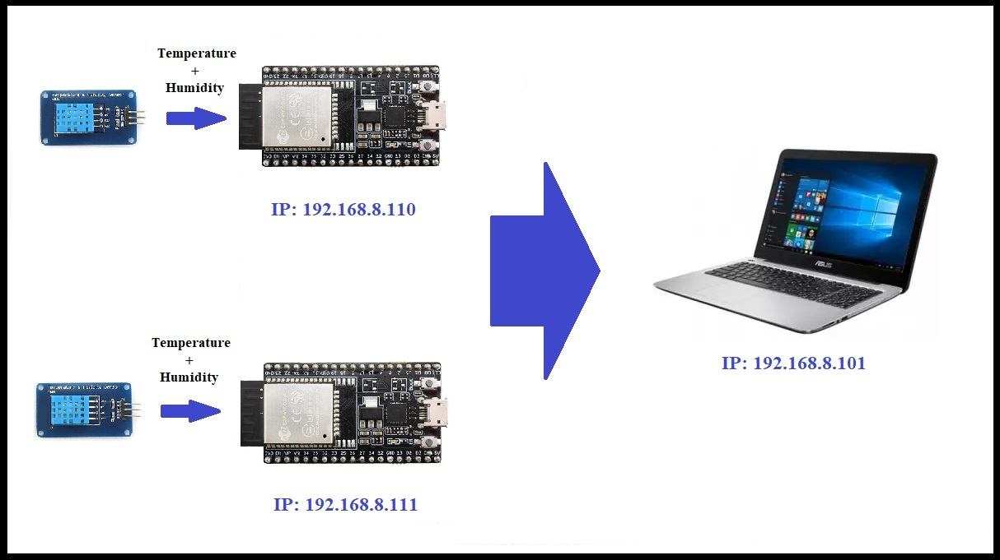

# ESP32-WiFi-TempSensor

This project implements a WiFi-based temperature and humidity monitoring system using an ESP32 microcontroller. It utilizes a DHT11 sensor for environmental measurements and communicates the data to a remote device using UDP protocol.



## Features

- WiFi communication using UDP
- Temperature and humidity monitoring using DHT11 sensor
- Remote control of data transmission interval
- RSSI (Received Signal Strength Indicator) reporting
- Static IP configuration

## Hardware Requirements

- ESP32 development board
- DHT11 temperature and humidity sensor
- Appropriate power supply

## Software Dependencies

- Arduino IDE
- ESP32 board support for Arduino
- WiFi library (built-in with ESP32 board support)
- WiFiUdp library (built-in with ESP32 board support)
- DHT sensor library

## Installation

1. Install the Arduino IDE and ESP32 board support.
2. Install the required libraries:
   - DHT sensor library
3. Clone this repository or download the source code.
4. Open the `.ino` file in Arduino IDE.

## Configuration

Before uploading the code, make sure to configure the following parameters:

```cpp
const char* ssid = "name";
const char* password = "pass";
int numNode = 1;
float numPeriod = 3000;
IPAddress localDevIP(192, 168, 8, 110);
IPAddress remoteDevIP(192, 168, 8, 102);
IPAddress gateway(192, 168, 8, 1);
IPAddress subnet(255, 255, 255, 0);
unsigned int localUdpPort = 61500;
unsigned int remoteUdpPort = 61501;
```

- Set your WiFi SSID and password
- Adjust the local and remote IP addresses, gateway, and subnet to match your network configuration
- Modify the UDP ports if necessary

## Usage

1. Upload the code to your ESP32.
2. Open the Serial Monitor to view debug information.
3. The ESP32 will connect to the specified WiFi network and start sending data to the remote IP address.
4. The remote device can send a new transmission interval (in milliseconds) to the ESP32 to change the data sending frequency.

## Data Format

The ESP32 sends data in the following format:

```
Node=1 & Counter=1 & Temperature=25.50 & Humidity=60.00 & RSSI=-70
```

## Remote Control

Send a UDP packet containing a number (in milliseconds) to change the transmission interval. For example, sending "5000" will change the interval to 5 seconds.

## Contributing

Contributions to improve the project are welcome. Please feel free to submit a Pull Request.

## License

This project is open-source and available under the [MIT License](LICENSE).
